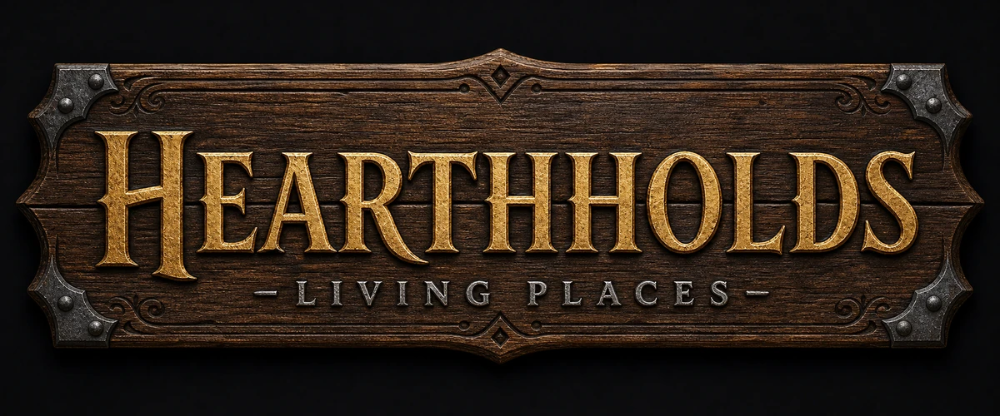
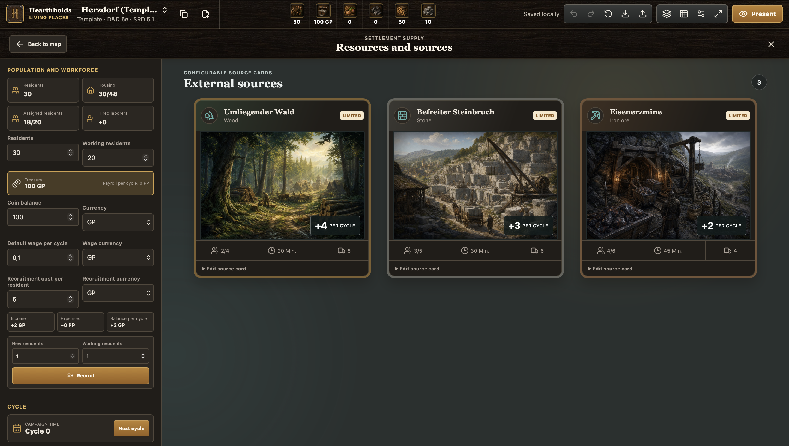

<p align="center">
  
</p>

# Hearthholds: Living Places

Hearthholds is a local-first settlement workspace and visual map editor for
tabletop role-playing games. It helps game masters create and maintain living
places—from villages and farms to estates, forts, and other evolving
settlements.

> [!IMPORTANT]
> Hearthholds is in active alpha development. Documents are stored locally in
> the browser and the file format may still evolve. Export important settlements
> regularly even when using the installable offline PWA.

Testing the Friends & Family release? Start with the concise
[installation, backup, and feedback guide](docs/friends-and-family.md). The
hosted PWA needs no Node.js or npm installation.

## Screenshots

### Settlement map editor


_Build and maintain a metric settlement map with construction states, editable
objects, resources, workforce, and a presentation-ready canvas._

### External resource cards



_Manage configurable off-map sources as illustrated cards and resolve their
workers, deliveries, and production through configurable cycles._

## Current capabilities

- Metric settlement maps with configurable dimensions, grid scale, tint, and
  opacity.
- Editable terrain, forests, fields, roads, rivers, walls, palisades, and gates.
- Data-driven building catalog with construction phases and upgrade tiers.
- Object transforms, marquee and multi-selection, grouping, locking, layers,
  and persistent scene ordering.
- Population, housing, resident workers, hired laborers, workplaces, and a
  settlement treasury.
- Workforce-dependent cycle production from functional buildings and external
  resource sources.
- Construction projects with material reservations, staffing requirements,
  prerequisites, and cycle progress.
- Compact resource artwork bar with detailed production and consumption hover
  cards.
- Editable bundled templates as well as completely blank maps.
- Local IndexedDB autosave, undo/redo, and validated versioned JSON import/export.
- Installable offline PWA with a generated full-asset precache and controlled,
  save-before-reload updates.
- German and English interface languages.
- Light and dark themes based on the Hearthholds branding.
- Presentation mode with automatic map fitting and progressive browser
  fullscreen support.

## Project status

The current release is a Friends & Family alpha for installation and practical
GM evaluation. GitHub Pages deployment is automated, but this is not yet a
general-availability release.

In particular:

- Browser storage is local to the current browser profile and device.
- Clearing site data can remove locally stored settlements.
- Chromium is the primary automated browser target today; Firefox and WebKit
  coverage is planned before a public pilot.

## Use the hosted app

Open the GitHub Pages URL supplied with your test invitation. On a current
Chrome or Edge browser, use Hearthholds' install prompt or the install icon in
the address bar. The installed PWA launches like a desktop application and is
available offline after the first complete online start.

No Node.js or npm installation is required for this route. See the
[Friends & Family guide](docs/friends-and-family.md) before creating important
settlements, especially its backup and privacy notes.

## Getting started

### Requirements

- Node.js 22 (or another version allowed by `package.json`)
- npm
- A modern desktop browser

### Development server

```bash
npm install
npm run dev
```

Vite prints the local URL after startup, normally
`http://localhost:5173`.

### Production build

```bash
npm run build
npm run preview
```

The default production baseline follows Vite 8: Chrome and Edge 111 or newer,
Firefox 114 or newer, and Safari/iOS 16.4 or newer. Older browsers are not an
explicit target.

The production build emits `manifest.webmanifest` and `sw.js`. After the first
online start, all bundled application and artwork assets are available offline.
When a new worker is ready, Hearthholds offers a controlled update and saves
pending document changes before activating it.

## Quality checks

```bash
npm run typecheck
npm test
npm run build
npm run test:e2e
```

The project uses TypeScript, Vitest, and Playwright. Domain tests cover geometry,
construction, resources, workforce allocation, persistence migrations, and
editor behavior. The browser suite covers the main Chromium editor workflows,
including persistence, PWA installation metadata, offline restart, cached
assets, and fullscreen presentation.

## Basic controls

| Input | Action |
| --- | --- |
| `WASD` or arrow keys | Move the selected object by one grid cell, or pan the map when nothing is selected |
| `Shift` + movement | Move by five grid cells |
| Right mouse drag | Pan the map |
| Two-finger trackpad gesture | Pan the map |
| Trackpad pinch | Zoom |
| `R` / `Shift+R` | Rotate the selection clockwise / counterclockwise |
| `G` | Toggle the map grid |
| `Cmd/Ctrl+G` | Group the current selection |
| `Cmd/Ctrl+Shift+G` | Ungroup the current selection |
| `Escape` | Close the active context, clear the selection, or leave presentation mode |

The terrain tab provides metric brushes for grass, soil, mud, stone, and sand.
Each completed brush stroke creates one undo step.

## Local data and documents

Hearthholds follows a local-first model:

- Settlements and template edits are stored in IndexedDB.
- Changes are saved automatically during development.
- Bundled templates remain available as reset sources.
- A template can be edited directly or copied into an independent settlement.
- Blank settlements can be created without a predefined map.
- Exports use the current versioned document schema (`schema 16`).
- Older schema-10 through schema-15 documents are migrated step by step when loaded.
- JSON imports are validated and can be stored as a copy or explicitly replace
  a local document with the same ID.

JSON files now provide a restore path for complete settlement documents. A
future project archive is still required for user-supplied bitmap assets.

## Architecture

```text
assets/             branding, building, terrain, and resource artwork
docs/               product decisions, concept, and backlog
src/components/     editor and management UI
src/domain/         map, construction, resources, and workforce rules
src/i18n/           typed German and English translations
src/persistence/    IndexedDB storage and document migration
src/store/          editor state, history, and commands
tests/e2e/          Playwright browser workflows
```

The application is built with React, TypeScript, Vite, Zustand, Immer, Konva,
Dexie, Zod, Radix UI, and Lucide.

## Documentation

Detailed product documentation is currently maintained in German:

- [Decision log](docs/entscheidungen.md) — binding decisions for the current state
- [Product and technical concept](docs/produktkonzept.md) — domain model and reference scenario
- [Product and technical backlog](docs/backlog.md) — agreed and proposed work that is not yet implemented
- [Brand asset guide](assets/branding/README.md) — wordmark, icons, favicon, and shared textures
- [Friends & Family guide](docs/friends-and-family.md) — installation, offline use, backup, and feedback
- [Privacy](PRIVACY.md) — local storage and hosting boundaries
- [Security policy](SECURITY.md) — confidential vulnerability reporting
- [Contributing](CONTRIBUTING.md) — local setup and contribution checks
- [Third-party notices](THIRD_PARTY_NOTICES.md) — required attribution and dependency notices
- [Changelog](CHANGELOG.md) — published versions and known limitations
- [Deployment guide](docs/deployment.md) — GitHub Pages setup and release checklist

## Near-term roadmap

1. Explicit Firefox and WebKit test coverage.
2. Complete backup and document-management workflows.
3. Versioned templates and project archives with user-supplied assets.
4. Resource booking history and broader project management.

The authoritative roadmap is maintained in
[the product backlog](docs/backlog.md).

## Branding

The master wordmark, web variants, app icons, favicon, and shared wood textures
live in [`assets/branding`](assets/branding/README.md). The application icon uses
the original `H` from the master wordmark. Both color themes reuse the wood,
gold, silver, and teal material language of the Hearthholds identity.

## License

Hearthholds uses a mixed-license model:

- Software is licensed under `AGPL-3.0-or-later`.
- Documentation and designated project artwork are licensed under
  `CC BY-SA 4.0`.
- The Hearthholds name, wordmarks, app icons, and favicon are reserved branding.

See [LICENSING.md](LICENSING.md) for the exact scope, attribution requirements,
and brand-use permission. Required third-party attribution is collected in
[THIRD_PARTY_NOTICES.md](THIRD_PARTY_NOTICES.md).
